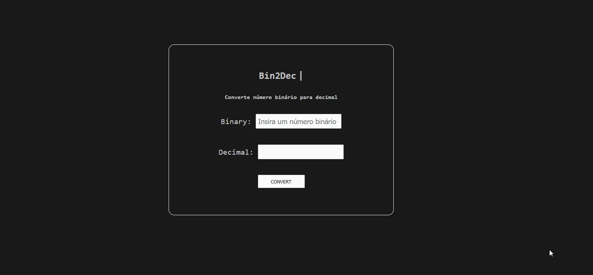

# Bin2Dec

Este é um conversor binário para decimal.

## Tecnologias Utilizada

  

## **Como funciona?**

* Para utiliza-la é simples, basta colocar em binário que automaticamente é convertido para decimal.

## **Prévia**

* Você pode acessar esse site e testa-lo através deste [link](https://guilhqueiroz.github.io/Bin2Dec/index.html)

### Entre em contato comigo: 

### Adicionais 

* Qualquer feedback ou sugestões de melhorias são bem-vindos.
